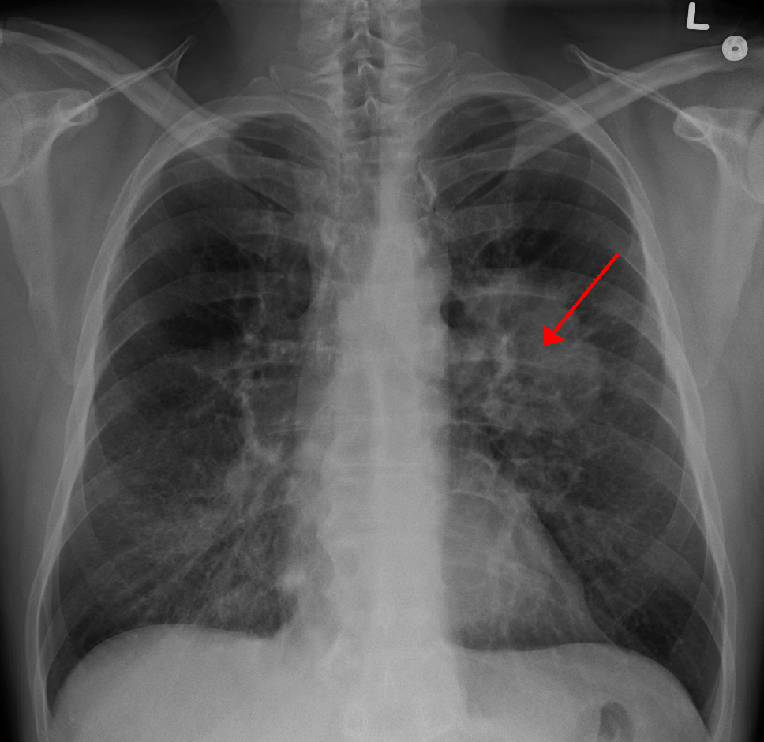
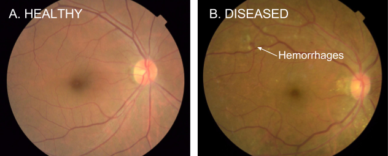
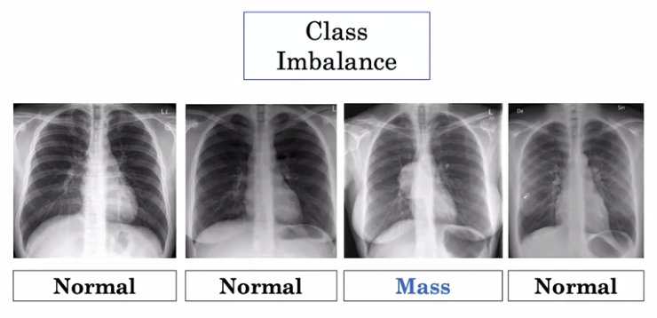
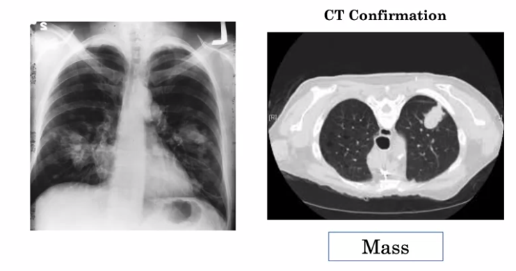

# Week1 of AI for Medical Diagnosis
Welcome to the AI for Medicine Diagnosis week 1 !!

These courses go beyond the foundations of deep learning to teach you the nuances in applying AI to medical use cases. If you are new to deep learning or want to get a deeper foundation of how neural networks work, we recommend taking the [Deep Learning Specialization](https://www.coursera.org/specializations/deep-learning).

In the first course, you learn about building machine learning models for diagnosis.

In particular, you will:
- Data preparation : Pre-process (visualization) and prepare a real-world X-ray dataset (data leakage prevention)
- Model Development : Use Transfer Learning to retrain a DenseNet model for X-ray image classfication
- Weighted Loss : Learn a technique to handle Class Imbalance.
- Evaluation : Measure diagnostic performace by computing the AUC (Area Under the Curve)* for the ROC (Receiver Operating Characteristic) curve
- Visualize model activity using GradCAMs

# Applications of Computer vision to medical diagnosis

- Definition of "Lung Mass": A lung mass is defined as an abnormal spot or area in the lungs that are more than 3 centimeters (cm), about 1.5 inches, in size. Spots smaller than 3 cm in diameter are considered lung nodules. The most common causes of a lung mass differ from that of a lung nodule, as well as the chance that the abnormality may be cancer. [[ref](https://www.verywellhealth.com/lung-mass-possible-causes-and-what-to-expect-2249388)]

Even though we do not know above definition of "Lung Mass", we can verify whether it is normal or abnormal by inspecting a lot of examples of normal/abnormal : This is how we teach the deep learning models.

### Training, prediction, and loss
- Training : During training, an algorithm is shown images of chest X-rays labeled with whether they contain a mass or not
- Prediction : The algorithm produces an output in the form of scores, which are probabilities that the image contains a mass.
- Loss : From the probability score that the model predicted, we compute "Error" with the desired score.

### Medical Image Diagnosis
Examples of Medical image diagnosis
- Dermatology(the branch of medicine dealing with the skin) and skin cancer detection
- Ophthalmology (the diagnosis and treatment of eye disorders) [[LINK](https://www.mobihealthnews.com/content/google-researchers-use-deep-learning-detect-diabetic-retinopathy-upwards-90-percent-accuracy)]

- Histopathology, a medical specialty involving examination of tissues under the microscope.

### Data Exploration & Image Pre-processing
Below are the common steps to check the data before feeding into the model
- Data types and null values check
- Unique IDs check
- Explore data labels
- Investigate a single image
- Investigate pixel value distribution
- Standardization by subtracting the mean and dividing by the standard deviation.

# How to handle class imbalance and small training sets
It is worth noting that our dataset contains multiple images for each patient. This could be the case, for example, when a patient has taken multiple X-ray images at different times during their hospital visits. In our data splitting, we have ensured that the split is done on the patient level so that there is no data "leakage" between the train, validation, and test datasets.

### Building and Training a Model for Medical Diagnosis
### Image Classfication and Class Imbalance
Three Key Challenges
- Class Imbalance 
- Multi-Task
- Dataset Size

### Class Imbalance Problem
What is Class Imbalance problem?
In a medical dataset, it's common to have not an equal number of examples of non-disease and disease.
- Non-disease examples > Disease examples 

Common Approches to solve "Class Imbalance" is 
- Weighted Loss : By counting the number of each labels and modifying the loss function to weighted loss with the ratio of each label 

### Resampling : Re-sample the dataset such that we have an equal number of normal and abnormal examples

With Resampling, you can use just standard loss function (not a weighted loss function)

Things to keep in mind when applying resampling
- may not be able to include all of the normal examples in re-sample data 
- may have more than one copy of abnormal examples which may lead to overfitting to the example

There are many variations of Resampling
- Oversampling the normal/abnormal case
- Undersampling the normal/abnormal case

For example, if you find that your training set has 70% negative examples and 30% positive
- reweight examples in training loss
- undersample negative examples
- oversample positive examples

### Binary Cross Entropy Loss Function
What is "Binary Cross Entropy Loss Function?"

### Multi-task challenge
Real World Problem is usually not a binary classficiation, but a  Multi-Task.

There could be various labels as below : 
- Mass or No Mass
- Pneumonia or No Pneumonia
- Edema or No Edema
- ...

We define **"Multi-Label/Multi-Task Loss"**.
For Multi-Task learning, We can apply the "weighted loss" that we have covered earlier.

## Dataset size : Working with a Small Training Set
"Convolutional Neural Network" is the most common and well suited architecture for processing image which require millions of examples in image classification.

However, the common dataset size in medical imaging is about **10 thousand to 100 thousand.**

## Transfer Learning
1. Pretrain the Network
2. Fine Tuning

Principle of Transfer Learning 
- the early layers of the network : Low level image features / Broadly generalizable / Edges of image
- the later layers of the network : High level image features / More specific to the task 

How to "Transfer Learning"?
- Case 1. To fine tune all of the layers (For moderate or large size of dataset)
- Case 2. Freeze early layers and only fine-tune the later or the last layer (For small size of dataset)

Given a very large dataset, you have the option of training a new model instead of using a pre-trained model.

## Data Augmentation
Generating More Samples : Data Augmentation
- Flipping (may harm the label)
- Rotation (most commonly adopted)
- Translation
- Zoom
- Change brightness or contrast
- Random Cropping
- Noise Insertion
- ...

Things to Keep in Mind when applying Data Augmentation
1. Does the transformation will make the network generalize better?
2. Do Augmentation Keep the Label the Same?

# The problem of Random Sampling
- The Test-set may not include disease case

To get a good estimate of the performance of the model both on non-disease and disease examples,
- sampling oreder : Test , Validation , Training
- sample a tests tset to have at least  X % of examples of our minority class.
- sample to have same distribution of classes as the test set. (same sampling strategy should be used)
- Remaining patients in Training set : Since test and validation set have been artificially sampled to have a large fraction of disease examples. (In the presence of imbalance data, you can still train your model!)
- It's bad to have patients in both training and test sets : Overly optimistic test performace
## Ground Truth and Consensus Voting
"How can we determine the correct label for an example?"

Consensus Voting from a board of doctors
- In medical settings, "Inter Observer Disagreement" is common.  
- To tackle the inter observer disagreement problem, we use "Consensus Voting".
- Use a group of human experts to determine the ground truth
- In general, the answer will be the majority vote of the three radiologist
- Consensus is considered less reliable than biopsy verification.  However, the limited availability of biopsy data means that consensus voting may still be the best (or only viable) option.

## Additional Medical Testing
Examples

CT(Computerized Tomography) + X-ray scan
- CT scan shows the 3D structure of the potential abnormality, thus giving the radiologists more information.
-  Keep in mind that there are likely fewer data examples where patients have both the chest x-ray and an additional diagnostic test for the same disease.

- In the dermatology study, the ground truth for the test set was determined by a skin lesion biopsy.(Biopsy : an examination of tissue removed from a living body to discover the presence, cause, or extent of a disease.)

