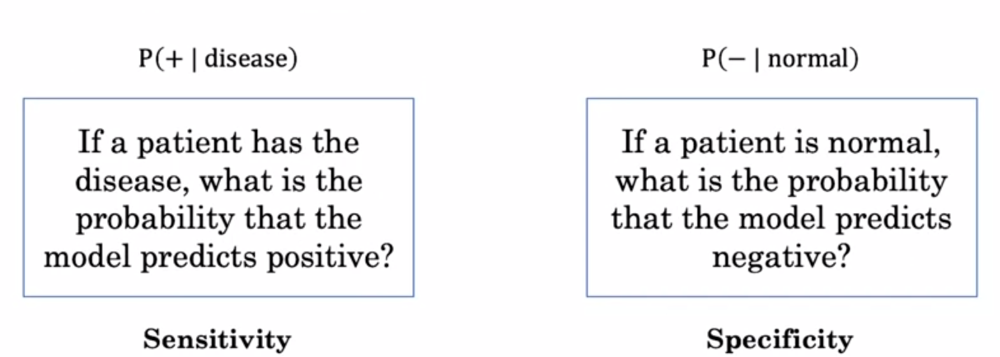
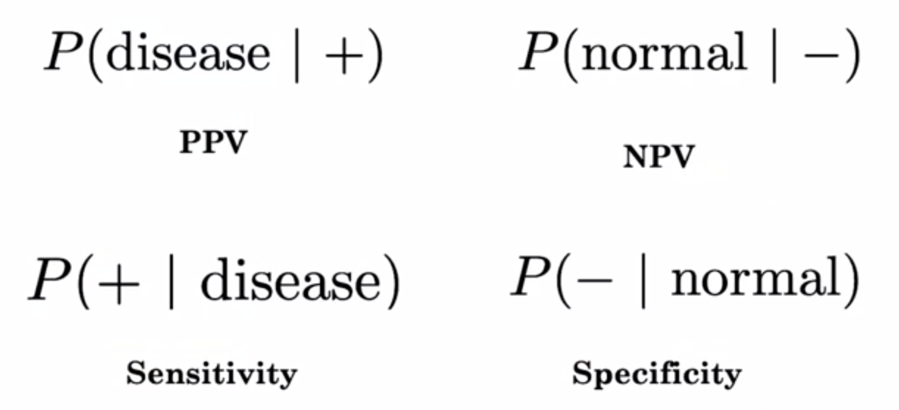

# Week2 of AI for Medical Diagnosis
Welcome to the AI for Medicine Diagnosis week 2 !!

By the end of this week, you will practice implementing standard evaluation metrics to see how well a model performs in diagnosing diseases.

Below are the lists of you will learn in this week. 
- **Accuracy** 
- **Sensitivity** (true positive rate) : How good the model is at correctly identifying those patients who actually have the disease and label them as having the disease.
- **Specificity** (true negative rate) : How good the model is at correctly identifying the healtht patients as not having the disease.
- **predictive values** 
- [**ROC(Receiver operating characteristic) curve**](https://en.wikipedia.org/wiki/Receiver_operating_characteristic)

## Accuracy, Sensitivity ,and Specificity

### Accuracy
- Accuracy = Examples correctly classified / Total number of examples = ( TP + TN ) / ( TP + TN + FP + FN )
- Accuracy = P(correct)
- Accuracy = Sensitivity x P(disease) + Specificity x P(normal)
- **Accuracy = Sensitivity x prevalance + Specificity x (1 - prevalance)**

Note that, prevalance = P(disease) and P(disease) + P(normal) = 1

### Sensitivity (= True positive rates = Recall)
- Sensitivity : How good the model is at correctly identifying those patients who actually have the disease and label them as having the disease.
- Sensitivity = P(predict positive | actual positive)
- Sensitivity = TP / (TP + FN)
The probability of a patient having disease in a population is called the prevalance.

### Specificity (= True negative rates)
- Specificity : How good the model is at correctly identifying the healtht patients as not having the disease.
- Specificity : P(predict negative | actual negative)
- Specificity : TN / (TN + FP)

Note that the terms "positive" and "negative" don't refer to the value of the condition of interest, but to its presence or absence; the condition itself could be a disease, so that "positive" might mean "diseased", while "negative" might mean "healthy".

- Positive(+) : when predicted **correct** given a patient has **disease**.
- Negative(-) : when predicted **correct** given a patient has **no disease**. 

In medical diagnosis, test sensitivity is the ability of a test to correctly identify those with the disease (true positive rate), whereas test specificity is the ability of the test to correctly identify those without the disease (true negative rate).

A sensitivity of 1 would mean that the model identifies all the diseased patients as having the disease, and does not identify any healthy patients as healthy. This is what the model is doing in this example.

## PPV(Positive Probability Value) and NPV(Negative Probability Value)

PPV
- If a model prediction is positive, what is the probability that a patient has the disease?
- P( disease | + )
- Comparable to Sensitivity which is P( + | disease )
- (*sensitivity* x *prevalance*) / (*sensitivity* x *prevalance* + (1 - *specificity*) x (1 - *prevalance*))

NPV
- If a model prediction is negative, what is the probability that a patient is normal?
- P( normal | - )
- Comparable to Specificity which is P( - | normal )

## Confusion matrix

## ROC curve
- allows us to visually plot the sensitivity of a model against the specificity of the model at different decision threshold.

## confidence interval
p : population accuracy
p hat : sample accuracy

In statistics, a confidence interval (CI) is a type of estimate computed from the statistics of the observed data. This proposes a range of plausible values for an unknown parameter (for example, the mean). The interval has an associated confidence level that the true parameter is in the proposed range. Given observations x_1,..., x_n and a confidence level, a valid confidence interval has a confidence level probability of containing the true underlying parameter. The level of confidence can be chosen by the investigator. In general terms, a confidence interval for an unknown parameter is based on sampling the distribution of a corresponding estimator.

Interpretation of 95% confidence
- In repeated sampling, this method reproduces intervals that include the population accuracy(true proportion) in about 95% of samples
