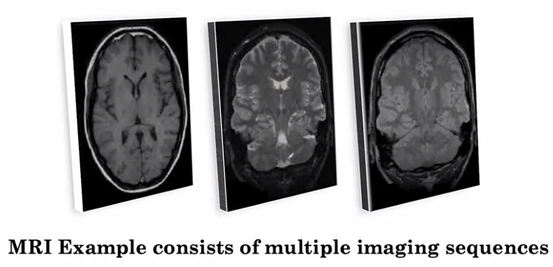

# Week3 of AI for Medical Diagnosis
Welcome to the AI for Medicine Diagnosis Week 3 !!

By the end of this week, you will prepare 3D MRI data, implement an appropriate loss function for image segmentation, and apply a pre-trained U-net model to segment tumor regions in 3D brain MRI images.


In particular, you will:
- Perform image segmentation on 3D MRI data.
- Take random sub-samples from a 3D image.
- Standardize an input image.
- Apply a pre-trained U-Net model.
- Implement a proper loss function for model training (soft dice loss).
- Evaluate model performance by calculating sensitivity and specificity.

## MRI Data and Image Registration
Compared to 2D image like X-rays, MRI sequence is a 3D volume.
<p align="center"></p>

The key idea that we will use to combine the information from different sequences is to **treat them as different channels.**
- Idea : RGB color channel -> Depth channel
- You extend this idea to stacking more than just 3 channels.
- Challenge : Misalignment problem
- Preprocessing : [image Registration](https://en.wikipedia.org/wiki/Image_registration) is the solution to the misalignment problem.

Note that, most of the 3D volume data in medical setting needs preprocessing step of **image registration**.
<p align="center"><image width="30%" src="images/image_registration.jpg"/></p>

## Segmentation
What is Segmentation?
- The process of defining the boundaries of various tissues.
- The task of determining the class of every point(in 2D : pixel, in 3D : voxel).

Why 3D approach?
- 2D lose important **3D context** when using this approach. 
- For instance, if there is a tumor in one slice, there is likely to be a tumor in the slices right adjacent to it.

Why not use whole sequence of MRI data?
- In the 3D approach, ideally, we'd want to pass in the whole MRI volume into the segmentation model and get out a 3D segmentation map for the whole MRI. However, the size of the MRI volume makes it impossible to pass it in all at once into the model. **It would simply take too much memory and computation.** 

## Loss function for Segmentation : Soft Dice Loss
[Dice Loss](https://en.wikipedia.org/wiki/S%C3%B8rensen%E2%80%93Dice_coefficient)

```python
def soft_dice_loss(y_true, y_pred, epsilon=1e-6): 
    ''' 
    Soft dice loss calculation for arbitrary batch size, number of classes, and number of spatial dimensions.
    Assumes the `channels_last` format.
  
    # Arguments
        y_true: b x X x Y( x Z...) x c One hot encoding of ground truth
        y_pred: b x X x Y( x Z...) x c Network output, must sum to 1 over c channel (such as after softmax) 
        epsilon: Used for numerical stability to avoid divide by zero errors
    
    # References
        V-Net: Fully Convolutional Neural Networks for Volumetric Medical Image Segmentation 
        https://arxiv.org/abs/1606.04797
        More details on Dice loss formulation 
        https://mediatum.ub.tum.de/doc/1395260/1395260.pdf (page 72)
        
        Adapted from https://github.com/Lasagne/Recipes/issues/99#issuecomment-347775022
    '''
    
    # skip the batch and class axis for calculating Dice score
    axes = tuple(range(1, len(y_pred.shape)-1)) 
    numerator = 2. * np.sum(y_pred * y_true, axes)
    denominator = np.sum(np.square(y_pred) + np.square(y_true), axes)
    
    return 1 - np.mean(numerator / (denominator + epsilon)) # average over classes and batch
```

## Different Populations and Diagnostic Technology
One of the main challenges with applying AI algorithms in the clinic, is achieving reliable generalization.

Examples
- tuberculosis is quite prevalent in India, but unlikely to be as prevalent in the hospitals where we've trained our model in the US.
- Different Resolution of CT scanners

## External validation
To be able to measure the generalization of a model on a population that it hasn't seen, we want to be able to evaluate on a test set from the new population.

## Measuring Patient Outcomes
In the real world, we want to be able to look at the effect of our model on real patients
- Decision curve analysis, which can help quantify the net benefit of using a model to guide patient care
- See what happens in the setting of a randomized control trial where we compare patient outcomes for patients on whom the AI algorithm is applied versus those on whom the AI algorithm is not applied. 
- Algorithminc bias
- Model Interpretation : achieving a better understanding of how these algorithms will interact with the decision-making of clinicians.

References
- https://www.jeremyjordan.me/semantic-segmentation/
